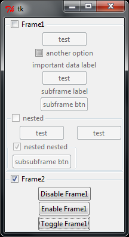

# check-labelframe
A type of LabelFrame widget that adds a checkbox. The checkbox enables or disables all the contents of the LabelFrame. 

To use, just use `CheckLabelFrame` instead of `ttk.LabelFrame` in your code. 

Tested in python2 and python3; in windows and linux. 
